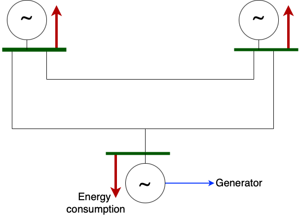
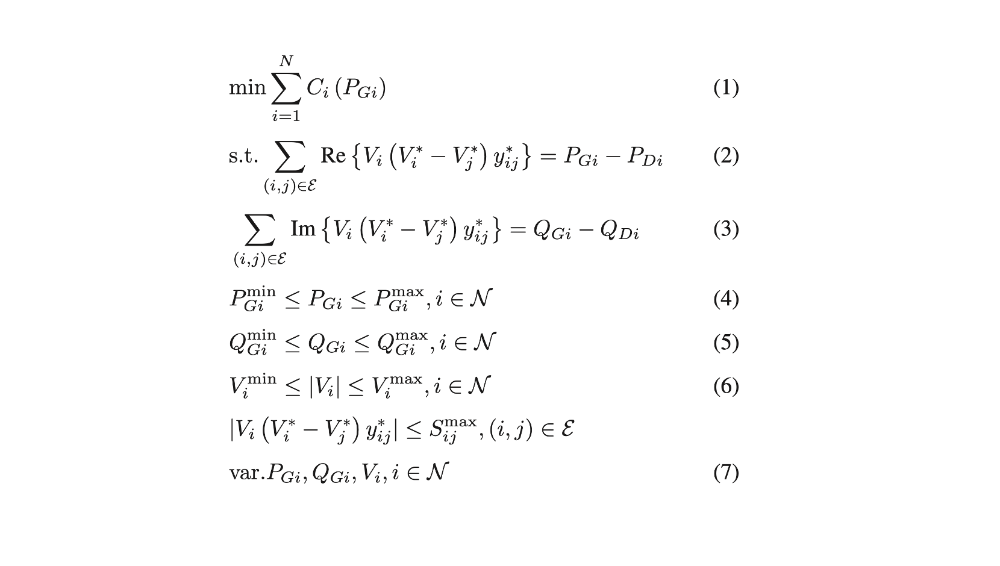

# Intro

AC-OPF is a fundamental problem in power system optimization, aimed at determining the optimal settings for generators and various control variables. The goal is to minimize operating costs while adhering to a range of operational constraints.

In the rapidly evolving energy sector, the ability to quickly and efficiently solve the AC-OPF problem is becoming increasingly important. Faster and more scalable solutions enable real-time operational decisions and facilitate the integration of intermittent renewable energy sources like wind and solar power. Traditional methods, such as nonlinear programming, often struggle with the scale and complexity of modern power grids, leading to slower response times and potential inefficiencies.

Recent advancements in artificial intelligence, particularly deep learning, have introduced neural networks as a powerful alternative to traditional optimization methods. Neural networks can approximate complex, nonlinear functions, making them well-suited for modeling the intricacies of AC-OPF problems. By leveraging PyTorch, a leading deep learning framework, we will train neural networks to provide fast, scalable solutions for AC-OPF. This approach not only speeds up the computation but also enhances the ability to handle larger and more complex power grid systems.

# Climate Impact

The methods and tools introduced in this project can significantly contribute to mitigating climate change through various pathways:

- **Renewable Energy Integration:** Solving AC Optimal Power Flow quickly and in real time is crucial for efficiently integrating and managing renewable energy sources such as wind and solar power. By optimizing the operation of power systems with a neural network-based AC-OPF approach, we can better accommodate renewable energy generation, reducing reliance on fossil fuel-based generation and lowering greenhouse gas emissions.

- **Enhancing Energy Efficiency:** AC-OPF helps optimize the dispatch of power generation units, enabling more efficient utilization of available resources. By minimizing system losses and improving overall energy efficiency, the neural network-based AC-OPF model can contribute to reducing carbon emissions associated with power generation.

- **Grid Resilience and Stability:** AC-OPF plays a significant role in maintaining grid resilience and stability. By accurately modeling and optimizing the power flow, the neural network-based AC-OPF model can enhance grid stability, reduce the risk of blackouts, and otherwise improve the operation of the power grid.

# Fundamentals of Power Grids

Figure source: [Senate RPC](https://www.rpc.senate.gov/policy-papers/infrastructure-cybersecurity-the-us-electric-grid)

**_Electrical power systems_** (or grids or networks) are extensive infrastructures designed to facilitate the generation, transmission, and utilization of electricity. These systems cater to a wide array of customers, including residential, industrial, and commercial entities. Key components of electrical power systems include:

- **Electrical Generators**: Located in power plants, these devices convert various forms of energy (such as chemical, nuclear, or renewable) into electrical energy.
- **Transmission Lines**: Comprising overhead lines and underground or submarine cables, these are mounted on towers or laid below ground to transport electricity over long distances.
- **Transformers and Substations**: Essential for modifying electrical voltage to suitable levels, transformers ensure efficient power transmission over long distances and facilitate effective distribution within localized areas.
- **Load/Demand**: These are the end-users of electricity, which include household appliances, industrial machinery such as furnaces and motors, and commercial facilities that use electricity for processes and lighting.

## The Role of Alternating Current

Alternating current (AC) is the standard form of electricity supplied to homes and businesses. Unlike direct current (DC), where the electric charge flows in a single direction, AC periodically reverses direction. This behavior is typically represented as a sinusoidal wave, where the current and voltage oscillate back and forth. This section explains the background of AC, its advantages, and why it is predominantly used in power systems.

The choice of AC over DC for mainstream power distribution was largely settled by the "War of Currents" in the late 19th century, where Thomas Edison and Nikola Tesla were prominent figures. Tesla, backed by George Westinghouse, advocated for AC due to its ability to easily transform to different voltages using transformers.

**Why Use AC?**

- **Efficient Long-Distance Transmission**: AC is favored for transmitting power over long distances due to its ability to be easily transformed between different voltage levels.
- **Simplicity and Cost-effectiveness**: The equipment needed to generate, transform, and use AC is simpler and less expensive than that required for comparable DC systems.

**Fundamental Concepts:**

- **Active and Reactive Power:**
  - Active Power: This is the "real" power that actually performs work, like lighting a bulb or heating an oven.
  - Reactive Power: This power does not perform work but is necessary to maintain the voltage levels required for stable power supply and efficient system performance.
- **Voltage and Current Waveforms:** The magnitude and phase angle of these waveforms are essential for everything from the design of electrical circuits to the real-time management of power systems.

## Modeling Power Grid

To effectively approach the problem of AC Optimal Power Flow (OPF), it is essential to have a foundational understanding of the structure and functioning of the power grid. The power grid is structured as a network of **nodes** (commonly referred to as buses) interconnected by transmission **lines** (also known as branches).

Here’s a breakdown of these components:

### Nodes/Buses

In this diagram, each green line represents a node in the power network. Each node has a generator (the circle with a tilde in the middle) and a consumer (red arrow) connected to it. The consumer draws power from the node, while the generator injects power into the network from the node. The net power injection at each node is the difference between the generator output and consumer load.

Each node in a power grid is described by the following variables:

- Complex Power: $S=P+{\rm j}Q$
  - Active Power (P): Measured in watts (W), this is the power that actually performs work. It is the real component of the complex power. Active power is critical for determining how much energy is being converted into work and heat at a particular node.
  - Reactive Power (Q): Measured in volt-amperes reactive (VAR), this represents the power stored in the field of the electrical system. Unlike active power, it does not perform work but is crucial for maintaining the voltage levels necessary to transport active power through the network efficiently.
- Complex Voltage: $V=V_m e^{{\rm j \theta}}$
  - Voltage Magnitude ($V_m$): Expressed in volts (V), this is the measure of the electrical potential at the node. It is crucial for system stability and efficient power transfer. High voltage levels allow power to be transmitted over long distances with less loss.
  - Voltage Angle (θ): Measured in degrees or radians, this angle indicates the phase of the voltage relative to a reference point. It is crucial for synchronizing the phase of the voltage across the network, which affects how power flows from one node to another.

The power injection at each node can be modeled as:

1. $\underline{I}_n$: the current injected at the n-th node
2. $\underline{V}_n$: the voltage at the n-th node
3. $\underline{S}_n$: the total power injection at the n-th node

As discussed previously, both the voltage and current are phasors whose phases vary with time. We can represent them using complex numbers, with

1. $\underline{I}_n = I_n \cos(\theta) + \text{j} I_n \sin(\theta)$
2. $\underline{V}_n = V_n \cos(\theta) + \text{j} V_n \sin(\theta)$

The relationship between the power, current and voltage is given by

$\underline{S}_n = \underline{V}_n \underline{I}_n^* = P_n + \text{j} Q_n$,

where $P_n$ is the active power injection and $Q_n$ is the reactive power injection at node $n$.

### Lines/Branches

Transmission lines carry electrical energy from power generation units to distribution centers or directly to consumers. They play a pivotal role in ensuring that electricity generated at power stations reaches end-users across various geographic regions.

Transmission lines are characterized by its addimitance $Y= G+{\rm j}B$, where:

- Conductance $G$: Measures the ability of the line to conduct electric current. It represents the real part of the admittance and indicates the power dissipation in the line due to resistance. Higher conductance implies lower energy losses.
- Susceptance $B$: Represents the imaginary part of admittance and is crucial for understanding the capacitive or inductive nature of the line. Susceptance affects the reactive power flow and voltage regulation across the line.

The current flow ($I$) or power flow ($S$) through each transmission line in the power network is determined by both the line admittance and the voltage at the nodes connecting the line.

Consider two nodes: 𝑖 and 𝑗 , and say line 𝑙 connects them. Then
$$({V}_{i} - {V}_{j})  {Y}_{ij} = {I}_{ij}$$

We can usually model lines as a combination of resistive and inductive impedances, represented by $R_l, X_l$ respectively. This paradigm is an approximation for short lines, and the total impedance of the line is given by

$\underline{Z}_l = R_l + \text{j} X_l$

A more commonly used notion is that of 'admittance' which is simply the reciprocal of the impedance

$\underline{Y}_l = \frac{1}{\underline{Z}_l}$

The voltage difference across a line is the difference in node voltages at the endpoints, and we denote this difference by $\underline{V}_l$. We denote the current through a line by $\underline{I}_l$.

### Power balance

In electrical engineering, understanding the distribution and balance of electric power across a network is crucial. This understanding is primarily derived from two fundamental principles: Kirchhoff's Current Law (KCL) and Kirchhoff's Voltage Law (KVL). These laws are essential for analyzing circuits, ensuring that all power and energy flows are accurately accounted for.

**Kirchhoff's Current Law (KCL)**
KCL states that the algebraic sum of currents entering and exiting a node must equal zero. This principle ensures that there is no net accumulation of charge at any node: every charge that enters a node must also leave. For each node $i$, we have:
$$ {I}_i = \sum\limits_{j \in {N}_i} {I}_{ij} $$
where ${N}_i$ denotes all nodes connected to node $i$, and $I_{ij}$ is the current from node $i$ to node $j$.

**Kirchhoff's Voltage Law (KVL)**
KVL states that the sum of voltage differences around any closed loop in a circuit must be zero. This means that the total increase and decrease in voltage around any loop will cancel out, ensuring you return to the same voltage level from which you started. Consider two nodes: $i$ and $j$, and say line $l=(i,j)$ connects them. Then

$$({V}_{i} - {V}_{j})  {Y}_{ij} = {I}_{ij}$$

where ${I}_{ij}$ is the current flowing along a line connected to node $i$, and is positive when current is flowing away from the node.

**Power Balance Equation**

By combining KCL and KVL, we can derive the power balance equation for each node in the power system.

First, the complex power injection is jointly determined by voltage and current injection at node:

$$
S_i = V_i  I_i^*
$$

Using the expression for $ I_i $ from KCL, this becomes:

$$
S_i = V_i  \left(\sum_{j \in N_i} I_{ij}\right)^*
$$

Substitute $I_{ij}$ from KVL, this becomes:

$$
S_i = V_i \left(\sum_{j \in N_i} (V_i - V_j) Y_{ij}\right)^*
$$

Further, the complex power also equals to the difference between generation and demand as:
$$ S*i = (P*{G,i}-P*{D,i}) + {\rm j} (Q*{G,i}-Q\_{D,i})$$

Therefore, we derive the power balance equation:

$$
(P_{G,i} - P_{D,i}) + {\rm j}(Q_{G,i} - Q_{D,i}) = V_i \left(\sum_{j \in N_i} (V_i - V_j) Y_{ij}\right)^*
$$

This equation shows that the net power at any node is a balance between generated power, consumed power, and the complex power flow between nodes. This is critical for planning, operation, and optimization of power systems to ensure stable and efficient electricity distribution.

## Operating the Power Grid

The operation of power grids involves managing a complex network of generators, transformers, transmission lines, and distribution systems. These systems work together to ensure the reliable and efficient distribution of electricity from power plants to consumers. Here is an introduction to some of the critical operational objectives of power grids:

- **Generation cost**: The generation cost refers to the expenses involved in producing electricity. This includes the cost of fuel (coal, natural gas, nuclear material, etc.), operation and maintenance of power plants, and environmental compliance costs.
- **Power balance**: Power balance, as we introduced above, is crucial in the operation of power grids. It refers to the need to constantly balance electricity supply with the demand. If this balance is disrupted, it can lead to power outages or excessive strain on the grid, potentially causing equipment damage or failures.
- **Physical limits**: The physical limits of a power grid encompass the technical constraints of the network, such as the capacity of transmission lines, transformers, and substations. These components can only handle certain amounts of electrical load before becoming inefficient or risking damage.

In the project, we will introduce AC Optimal Power Flow, a fundamental mathematical model used to optimize the operation of power networks. It is solved to ensure efficient, safe, and economical power system operations.

# AC Optimal Power Flow

The AC-OPF problem is a complex nonlinear optimization problem that aims to find the optimal operating point of the power system, considering the various physical and operational constraints. Solving this problem is crucial for power system operators to ensure reliable, efficient, and secure operation of the power grid.

## AC-OPF formulation

The formulation presented here provides a comprehensive mathematical representation of the ACOPF problem:

- **Objective function** (Equation 1):
  The objective is to minimize the sum of the costs associated with the real power generation at each bus.
- **Power flow constraints** (Equations 2 and 3):
  These constraints ensure that the real and reactive power balance is maintained at each bus, accounting for the complex power flows in the network.
- **Variable bounds** (Equations 4-6):
  These constraints impose limits on the real and reactive power generation, as well as the voltage magnitudes at each bus, to ensure the feasibility of the solution.
- **Apparent power flow limit** (Equation 6):
  This constraint limits the <i>apparent power</i> flow (i.e., magnitude of the complex power flow) through each transmission line or transformer to a maximum value, ensuring that the system operates within its physical limits.
- **Optimization variables** (Equation 7):
  The optimization variables in this formulation are the real and reactive power generation, and the complex voltage (magnitude and angle).

In summary, solving the AC-OPF problem is essential for the efficient and reliable operation of power networks. It helps in optimizing power generation and distribution, ensuring economic operation, complying with physical and operational constraints, and enhancing the overall security and flexibility of the grid.

However, AC-OPF is non-linear and non-convex, which means solving it can be computationally expensive. Conventional approaches leverage various iterative optimization techniques to find a solution for AC-OPF.

for a network with $N$ nodes, the system operator would have to solve $2N$ non-linear equations at each time step.

## Conventional methods for AC-OPF

The solution of the AC-OPF provides a setpoint for power generators in order to satisfy a specific state of electricity consumption. Given its complexity, various methods have been developed to solve the AC-OPF problem. Here, we describe some conventional methods, including DC approximation, convex relaxation, and interior point methods:

- **DC approximation**: This approximation simplifies the AC-OPF problem by assuming that:
  - The transmission lines have no resistance, only reactance;
  - Voltage magnitudes at all buses are constant and set to their nominal values;
  - Phase angle differences across transmission lines are small.

Under these assumptions, the problem reduces to optimizing the active power flow, ignoring reactive power and voltage magnitude variations. This linearization makes the problem much easier to solve and is computationally efficient. However, the simplification leads to less accurate results, particularly in systems with high resistances, significant voltage variations, or substantial reactive power flows.

- **Convex relaxation**: This approach involves reformulating the non-convex ACOPF problem into a convex problem. The most common approach is the Semidefinite Programming (SDP) relaxation, which relaxes the rank constraint on the matrix representing voltage products. By turning the problem into a convex one, it can be solved more efficiently using standard convex optimization techniques. If the relaxed problem has an optimal solution that is "rank-one", it can be converted back into a feasible solution for the original ACOPF problem. However, there's no guarantee that an SDP relaxation will always yield a physically meaningful solution, especially in heavily loaded systems or systems with complex topologies.

- **Interior point methods**: This refers to a type of nonlinear optimization technique that is particularly effective for solving large-scale optimization problems like AC-OPF. These methods iterate towards the optimum by traversing the interior of the feasible region, avoiding boundary constraints until convergence is near. This approach is well-suited for handling the nonlinearities and non-convexities of AC-OPF, as it can efficiently deal with large numbers of constraints and variables.
